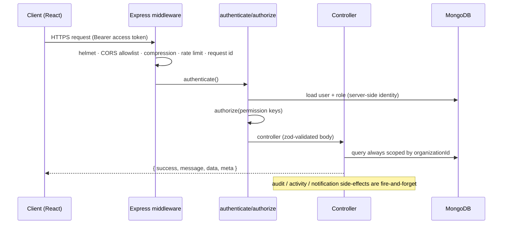
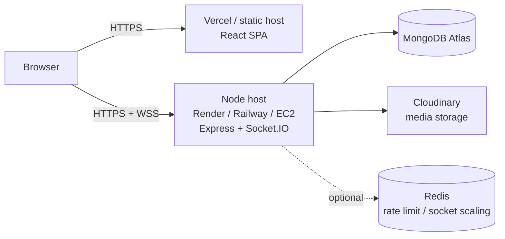

# Architecture

WorkTrack is an npm-workspaces monorepo with a REST + WebSocket backend and a SPA frontend.

```
task/
├── backend/          Express + TypeScript API (src/features/* per domain)
│   └── src/
│       ├── config/        env validation, db, logger, cloudinary
│       ├── constants/     permission keys, enums
│       ├── middlewares/   auth, authorize, validate, rateLimit, error, requestId
│       ├── models/        Mongoose schemas + indexes
│       ├── features/      auth, organizations, employees, teams, projects,
│       │                  modules, milestones, tasks, workUpdates, attachments,
│       │                  issues, comments, timeEntries, reports, notifications,
│       │                  activities, auditLogs, releases, analytics, search
│       ├── services/      audit, activity, notification, mailer
│       ├── sockets/       Socket.IO server (authorized rooms)
│       ├── seed/          idempotent demo data
│       └── utils/         ApiError, respond, pagination, counters, tokens
└── frontend/         React + Vite SPA (src/features/* per domain)
    └── src/
        ├── components/    ui kit, attachments, comments
        ├── features/      one folder per page/domain
        ├── layouts/       AppLayout (sidebar/header), AuthLayout
        ├── lib/           api client, socket, utils
        ├── stores/        zustand auth store
        └── types/         API types
```

## Request lifecycle



Every response uses one envelope. Success: `{ success: true, message, data, meta }`. Error: `{ success: false, message, code, errors[], requestId }` — stack traces are never exposed in production.

## Multi-tenancy

- Every organization-owned document carries `organizationId`, `createdBy`, and timestamps; soft deletion uses `deletedAt`/`archivedAt`.
- Identity and organization scope are resolved **on the server** from the access token — `organizationId`, roles, and permissions from the client are never trusted.
- Every query filters by the authenticated user's `organizationId` (`orgScope(req)` helper), so cross-organization reads return 404, not 403 — the other tenant cannot learn that a record exists.
- Readable identifiers (`WTH-12`, `BUG-3`, `UPD-45`, `EMP-7`) come from an atomic per-organization `counters` collection, never from collection counts.

## Real-time layer

Socket.IO authenticates the handshake with the same JWT used by the API and joins two rooms: `user:<userId>` and `org:<organizationId>`. Events (`notification:new`, `work_update:status`, `comment:new`) are emitted only to those rooms, so cross-organization leakage is impossible by construction. The frontend invalidates TanStack Query caches on these events.

## Deployment topology



The API is stateless (JWT + refresh-token sessions stored in MongoDB), so it can scale horizontally; Socket.IO needs a Redis adapter when running more than one instance (optional, not required for a single node).

## Key design decisions

- **Feature folders on both sides** — each domain owns its routes/controller (backend) or pages/components (frontend); no business logic in route files.
- **Metadata-only media** — binaries live in Cloudinary under `worktrack/organizations/{orgId}/projects/{projectId}/…`; MongoDB stores `publicId`, `secureUrl`, and labels. Failed metadata persistence rolls back the uploaded asset.
- **Review state machines** — work updates and issues enforce valid transitions server-side; the UI only offers legal next states.
- **Fire-and-forget side effects** — audit logs, activity timeline, and notifications never block or fail a request.
- **No fabricated data** — daily reports aggregate only real submitted work updates, issues, and time entries.
