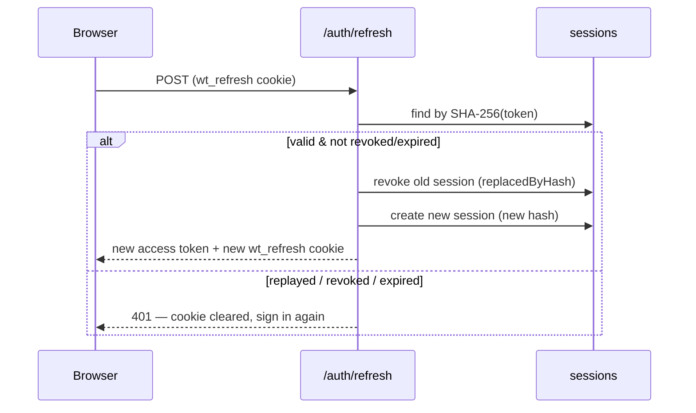

# Authentication

## Overview

- **Access token** — short-lived JWT (default 15 min), returned in the response body, kept **in memory** on the frontend (never localStorage).
- **Refresh token** — opaque 48-byte random string in an `HttpOnly`, `SameSite=Lax` cookie (`wt_refresh`) scoped to `/api/v1/auth`. Only its **SHA-256 hash** is stored server-side in the `sessions` collection.
- **Passwords** — bcrypt, cost 12. Strength enforced by Zod (10+ chars, upper, lower, digit).

## Refresh rotation

Replaying a rotated token fails (covered by tests). The frontend axios client refreshes once on 401 and retries the original request; concurrent 401s share a single refresh promise.

## Flows

| Flow | Behavior |
| --- | --- |
| **Register** | Creates organization + default roles + admin user, signs in immediately |
| **Login** | Uniform `Invalid email or password.` for wrong password *and* unknown email (no user enumeration); deactivated accounts are refused |
| **Forgot / reset password** | Always responds identically; single-use hashed token with expiry (default 30 min); reset revokes **all** sessions |
| **Change password** | Requires current password; revokes all sessions |
| **Invitations** | Admin invite → hashed token link (7-day expiry) → accept sets name/password and signs in; email ownership is proven by the link, so the account is verified |
| **Session management** | `GET /auth/sessions` lists login activity (device, IP, timestamps); revoke one or all |
| **Remember me** | Persistent cookie with expiry vs session cookie |

When SMTP is not configured, invitation and reset emails are **logged to the backend console** (and the invite API returns the URL for manual sharing) — see `services/mailer.service.ts` for the SMTP integration point.

## Rate limiting

Global API limiter (default 500 req/15 min/IP) plus a strict auth limiter (default 10 req/15 min/IP) on register, login, forgot/reset password, and accept-invitation.

## Audit

Security-sensitive events (register, login, password reset/change, session revocation, invitation lifecycle, employee activation/deactivation) are written to the immutable audit log with sensitive values redacted.
