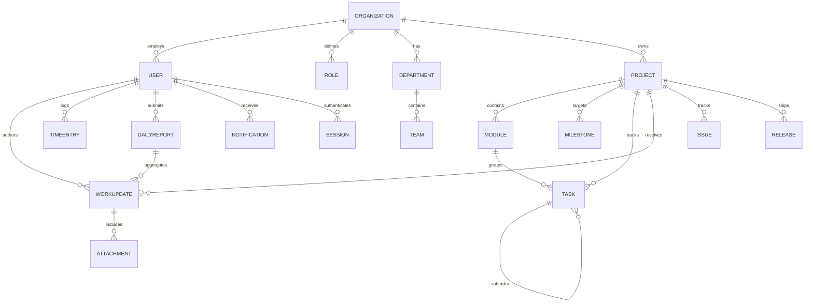

# Database Schema

MongoDB via Mongoose. Every organization-owned collection carries `organizationId` (indexed), `createdAt`/`updatedAt` timestamps, and where relevant `createdBy`, `updatedBy`, `archivedAt`, `deletedAt` (soft delete).

## Entity relationships

## Collections

| Collection | Purpose | Notable fields |
| --- | --- | --- |
| `organizations` | Tenant root | name, unique `slug`, timezone, workingDays/hours, settings (dateFormat, dailyReportCutoff, allowSelfApproval, allowMultipleTimers) |
| `users` | Employees + platform users | email, `passwordHash` (select:false), employeeCode, names, jobTitle, departmentId, teamId, managerId, roleId, `status` (invited/active/inactive/on_leave/suspended/exited), skills, hashed reset/verify tokens (select:false) |
| `sessions` | Refresh-token sessions | userId, `refreshTokenHash` (SHA-256, unique), userAgent, ip, expiresAt (TTL index), revokedAt, replacedByHash |
| `invitations` | Employee invites | email, roleId, `tokenHash` (unique), invitedBy, status, expiresAt |
| `roles` | Org-scoped RBAC | `key` (unique per org), name, `permissions[]` (see permission keys), isSystem |
| `departments` / `teams` | Org structure | name (unique per org), headId / leadId, memberIds |
| `projects` | Projects | name, `key` (unique per org), slug, managerId, `members[{userId, role}]`, status, priority, progress, health, tags, repository/staging/production URLs, visibility |
| `modules` | Dynamic project modules | projectId, name, `key` (unique per project), ownerId, memberIds, status, progress — defaults seeded (Leads, Salary, Attendance…) but fully configurable, never hardcoded |
| `milestones` | Delivery targets | projectId, name, dueDate, status, progress |
| `tasks` | Work items | `number` (e.g. `WTH-12`, unique per org), projectId, moduleId, milestoneId, parentTaskId (subtasks), type, status, priority, assigneeId, collaborators, reporter, reviewer, dates, estimate, loggedMinutes, checklist[], dependencyIds, git{}, watchers, `order` (kanban), blockedReason |
| `workupdates` | Flagship work log | `number` (`UPD-n`), author userId, project/module/task/issue/milestone links, title, workType, progressStatus, progress, workDate, planned/implemented/changed/remaining/outcome/blockers/dependencies/assistanceRequired/nextAction, `time{}`, `technical{}` (env, repo, branch, commit, PR, deployment, API, DB changes), attachmentIds[], beforeAfter[], status (draft→…→approved), review{}, reviewHistory[], editCount |
| `attachments` | Cloudinary metadata only | secureUrl, publicId, resourceType, format, bytes, dimensions, caption, altText, attachmentType (screenshot/before/after/evidence/error/…), uploadedBy, entityType/entityId |
| `issues` | Bug/error tracking | `number` (`BUG-n`), type, severity, priority, status (13-state lifecycle), reporter, assignee, environment, versions, `error{}` (message, stack, endpoint, browser…, occurrenceCount), `reproduction{}`, `resolution{}` (rootCause, fixSummary, code), history[] |
| `comments` | Discussions | entityType/entityId (polymorphic), authorId, body, mentionIds, parentId (threads), reactions[], pinned, resolvedAt |
| `timeentries` | Time tracking | userId, links (project/module/task/issue/update), startedAt/endedAt (server UTC), minutes, billable, source (manual/timer), `running`, corrections[] (audited edits) |
| `dailyreports` | Daily reports | userId, `date` (YYYY-MM-DD), aggregated projectIds/moduleIds/workUpdateIds/taskIds, issuesCreated/Resolved, totalMinutes, blockers, nextDayPlan, managerNotes, status |
| `notifications` | In-app notifications | userId, actorId, type, title, link, readAt |
| `activities` | Activity timeline | actorId, action, entityType/entityId, previous/new value, link |
| `auditlogs` | Immutable audit trail | actorId, action, entity, redacted previous/new data, ip, userAgent — update/delete blocked at schema level |
| `releases` | Release tracker | projectId, `version` (unique per project), environment, status, linked taskIds/issueIds/workUpdateIds, notes{}, git{} |
| `counters` | Atomic sequences | organizationId + key → seq (`$inc` upsert) — source of readable identifiers |

## Indexes

Unique, organization-scoped:

- `users`: `{organizationId, email}` · `roles`: `{organizationId, key}` · `departments`/`teams`: `{organizationId, name}`
- `projects`: `{organizationId, key}` · `modules`: `{organizationId, projectId, key}`
- `tasks` / `workupdates` / `issues`: `{organizationId, number}`
- `dailyreports`: `{organizationId, userId, date}` (prevents duplicate daily reports)
- `releases`: `{organizationId, projectId, version}` · `counters`: `{organizationId, key}`
- `sessions.refreshTokenHash`, `invitations.tokenHash`

Query-pattern indexes: status/priority/severity/assignee/due-date compounds (e.g. `tasks {organizationId, projectId, status, order}` for the board, `workupdates {organizationId, userId, workDate}` for reports), TTL on `sessions.expiresAt`, and text indexes on projects, tasks, work updates (title/description/implemented/blockers), and issues (title/description/error.message) as the portable search fallback. Swap these for MongoDB Atlas Search aggregations when available.
